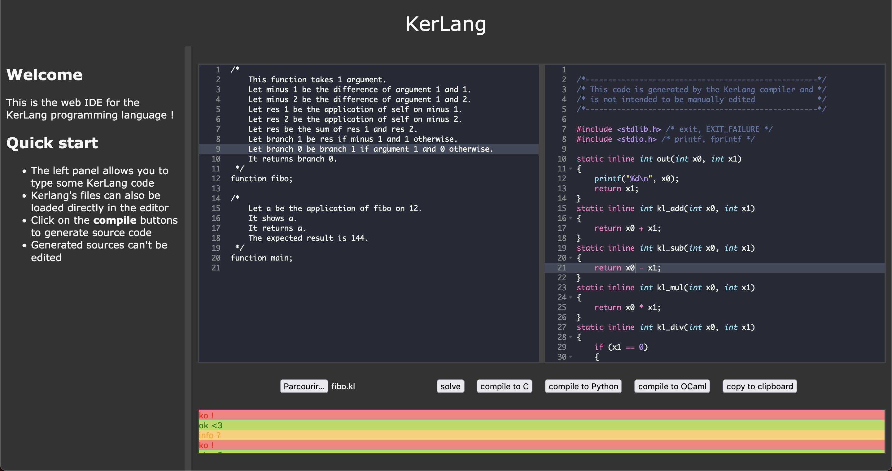

# KerLang

KerLang is an innovative programming language built with love by [Arthur Correnson](https://github.com/jdrprod) and [Anima Libera](https://github.com/anima-libera) for the first edition of [Lang Jam](https://github.com/langjam/jam0001). It features a state of the art compiler named "The Glorious KerLang Compiler" (also known as *the Glorious Ker-Lann Compiler* but who cares ?) and a first-class support for comment-oriented programming.

## What on Earth is *comment-oriented programming* ?

Writing good comments is CS 101. But we all know how hard it is to stay focus on writing comments and documentation. Comment-oriented programming propose a game changing approach to software development : instead of writing the code and then writing comments, KerLang enforce you to over-comment your code and the compiler generate the code for you !

Here is an example program :

```c
/*
	This function takes 1 argument,
	it returns the product of argument 1 and 2.
*/
function twice;
```

When executing a program written in KerLang, you first ask the compiler to generate code. The KerLang compiler is capable of producing code for the following languages:
+ Python3
+ C
+ OCaml

To generate code, one can simply specify an output file. The KerLang compiler will automatically decide which language to target based on the file extension. For example the command `gklc twice.kl -o twice.ml` will generate the following ocaml file :

```ocaml
(*----------------------------------------------------*)
(* This code is generated by the KerLang compiler and *)
(* is not intended to be manually edited              *)
(*----------------------------------------------------*)

let twice = (fun x0 ->
  (( * )
    x0
    2))
```

If you don't want to generate source code it is possible to execute it directly too ! To do so you just need to provide a `main` function in your sources, the execution of the main function can be requested using the `-x` option of the compiler.

Here is an example using a `main` function :

```c
/*
	This function takes 1 argument,
	it returns the product of argument 1 and 2.
*/
function twice;

/*
	It uses 8.
	It shows the application of twice on 3.
*/
function main;
```

If compiled into C, Ocaml or Python3, such program will call the `main` function automatically.

## More about KerLang

To know more about KerLang, examples are ready to be run in the `examples/` folder. The KerLang **manual** is also available as a pdf file.

## Build instructions

KerLang is crafted in pure OCaml (version **4.11.1**) with no dependencies other than [dune](https://dune.build) as its build system.

### Installing OCaml and dune

To install a suitable version of OCaml from scratch, the following commands should do the job on any OS

```
bash -c "sh <(curl -fsSL https://raw.githubusercontent.com/ocaml/opam/master/shell/install.sh)"
opam init
eval $(opam env)
opam switch create 4.11.1
opam install dune
```

### Compiling the project

Compiling the Glorious KerLang Compiler is as simple as typing `make` at the project's root !

### Using the IDE (experimental feature)

KerLang is shipped with an experimental web IDE. After building the project, one can simply launch the IDE by opening the file `web/app.html` in any web browser.


